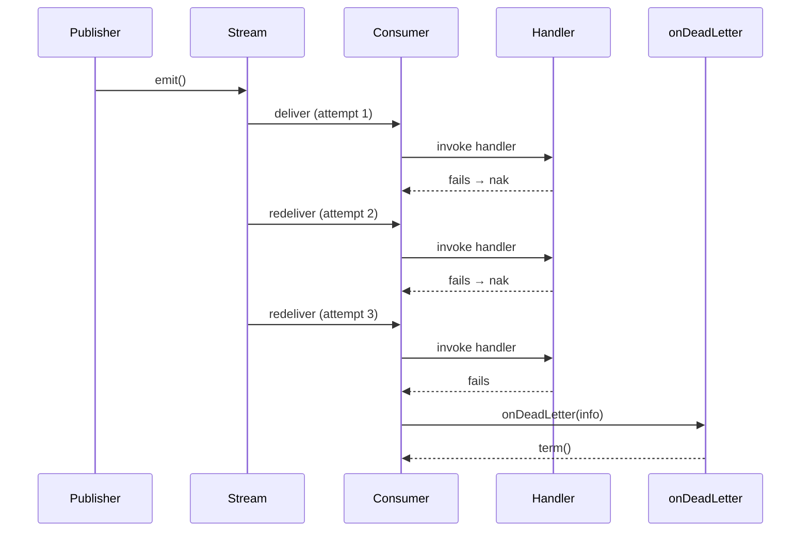

import Since from '@site/src/components/Since';

# Dead Letter Queue

<Since version="2.2.0" />

When a message fails on every delivery attempt and exhausts its `max_deliver` limit, the transport treats it as a **dead letter**. Instead of silently discarding the message, you get a callback with full context — enough to persist, inspect, or re-publish it.

## What is a dead letter?

In NATS JetStream, each consumer has a `max_deliver` setting (default: **3**). Every time a handler throws an exception, the message is `nak`'d and redelivered. Once the delivery count reaches `max_deliver`, the message has nowhere to go — it's "dead."

Without the `onDeadLetter` callback, the transport would simply `term()` the message after the final failed attempt. With the callback, you get a chance to save it before it's gone.



## Configuring the callback

Register `onDeadLetter` in `forRoot()` or `forRootAsync()`:

```typescript title="src/app.module.ts"
import { Module } from '@nestjs/common';
import { JetstreamModule } from '@horizon-republic/nestjs-jetstream';

@Module({
  imports: [
    JetstreamModule.forRoot({
      name: 'orders',
      servers: ['nats://localhost:4222'],
      onDeadLetter: async (info) => {
        console.error('Dead letter:', info.subject, info.error);
        // Persist to database, S3, another queue, etc.
      },
    }),
  ],
})
export class AppModule {}
```

## DeadLetterInfo fields

The callback receives a `DeadLetterInfo` object with everything you need to investigate the failure:

| Field | Type | Description |
|---|---|---|
| `subject` | `string` | The NATS subject the message was published to |
| `data` | `unknown` | Decoded message payload (already deserialized by the codec) |
| `headers` | `MsgHdrs \| undefined` | Raw NATS message headers |
| `error` | `unknown` | The error that caused the last handler failure |
| `deliveryCount` | `number` | How many times this message was delivered |
| `stream` | `string` | The stream this message belongs to |
| `streamSequence` | `number` | The stream sequence number (unique within the stream) |
| `timestamp` | `string` | ISO 8601 timestamp of the message (derived from NATS metadata) |

## Callback flow

The `onDeadLetter` callback is **async** and **awaited** before the message is acknowledged. The sequence is:

1. Handler fails on the final delivery attempt (`deliveryCount >= max_deliver`).
2. The transport builds a `DeadLetterInfo` object.
3. The `TransportEvent.DeadLetter` hook fires (for observability).
4. `onDeadLetter(info)` is called and awaited.
5. On success: the message is `term()`'d (terminated — removed from the stream permanently).
6. On failure: the message is `nak()`'d, giving the callback another chance on the next delivery cycle.

:::warning Safety net: callback failures trigger retry
If your `onDeadLetter` callback throws (e.g., the database is down), the message is **not** terminated. Instead, it is `nak`'d so that NATS redelivers it. This means your callback will be retried — but be aware that the delivery count has already reached `max_deliver`, so the message will be treated as a dead letter again on the next attempt.
:::

## DI integration with forRootAsync

In real applications, the dead letter callback typically needs access to injected services — a repository, a queue client, a logger. Use `forRootAsync()` to inject dependencies:

```typescript title="src/app.module.ts"
import { Module } from '@nestjs/common';
import { JetstreamModule } from '@horizon-republic/nestjs-jetstream';
import { DlqModule, DlqService } from './dlq';

@Module({
  imports: [
    DlqModule,
    JetstreamModule.forRootAsync({
      name: 'orders',
      imports: [DlqModule],
      inject: [DlqService],
      useFactory: (dlqService: DlqService) => ({
        servers: ['nats://localhost:4222'],
        onDeadLetter: async (info) => {
          await dlqService.persist(info);
        },
      }),
    }),
  ],
})
export class AppModule {}
```

### Example DLQ service

```typescript title="src/dlq/dlq.service.ts"
import { Injectable, Logger } from '@nestjs/common';
import { DeadLetterInfo } from '@horizon-republic/nestjs-jetstream';
import { DlqRepository } from './dlq.repository';

@Injectable()
export class DlqService {
  private readonly logger = new Logger(DlqService.name);

  constructor(private readonly repository: DlqRepository) {}

  async persist(info: DeadLetterInfo): Promise<void> {
    this.logger.error(
      `Dead letter on ${info.subject} (stream: ${info.stream}, seq: ${info.streamSequence})`,
      info.error,
    );

    // Store in your database for later investigation or replay
    await this.repository.save({
      subject: info.subject,
      payload: JSON.stringify(info.data),
      error: info.error instanceof Error ? info.error.message : String(info.error),
      deliveryCount: info.deliveryCount,
      stream: info.stream,
      streamSequence: info.streamSequence,
      occurredAt: info.timestamp,
    });
  }
}
```

## Observability with TransportEvent.DeadLetter

In addition to the `onDeadLetter` callback, the transport emits a `TransportEvent.DeadLetter` hook event every time a dead letter is detected. This fires **before** the callback, regardless of whether `onDeadLetter` is configured.

Use it for metrics, alerting, or structured logging:

```typescript
import { JetstreamModule, TransportEvent } from '@horizon-republic/nestjs-jetstream';

JetstreamModule.forRoot({
  name: 'orders',
  servers: ['nats://localhost:4222'],
  hooks: {
    [TransportEvent.DeadLetter]: (info) => {
      metrics.increment('dead_letter_total', {
        stream: info.stream,
        subject: info.subject,
      });
    },
  },
  onDeadLetter: async (info) => {
    await dlqService.persist(info);
  },
})
```

:::tip Hook vs callback
The `TransportEvent.DeadLetter` **hook** is synchronous and fire-and-forget — use it for lightweight observability (metrics, logs). The `onDeadLetter` **callback** is async and awaited — use it for persistence that must succeed before the message is terminated. See [Lifecycle Hooks](/docs/guides/lifecycle-hooks) for more on the difference.
:::

## Scope

Dead letter detection applies to **workqueue** and **broadcast** events only. It does not apply to:

- **RPC messages** — RPC uses a request/reply pattern with its own timeout mechanism. Failed RPC handlers return error responses to the caller rather than entering a dead letter flow.
- **Ordered events** — Ordered consumers are ephemeral and auto-acknowledged by the NATS client. There is no ack/nak cycle, so there is no concept of delivery exhaustion.

## What's next?

- [**Events (Workqueue)**](/docs/patterns/events) — retry flow and delivery semantics
- [**Broadcast Events**](/docs/patterns/broadcast) — fan-out delivery with per-instance DLQ
- [**Lifecycle Hooks**](/docs/guides/lifecycle-hooks) — observe transport events including dead letters
- [**Module Configuration**](/docs/getting-started/module-configuration) — `forRoot()` and `forRootAsync()` options reference
