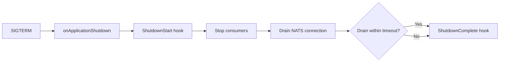

# Graceful Shutdown

The transport handles shutdown automatically through the NestJS application lifecycle. When the application shuts down, in-flight message handlers are given time to complete before the NATS connection is closed. No manual shutdown code is needed.

## How it works

The `JetstreamModule` implements NestJS's `OnApplicationShutdown` interface. When the application receives a termination signal (SIGTERM, SIGINT), NestJS calls the module's `onApplicationShutdown()` method, which triggers the following sequence:

1. **Emit `ShutdownStart` hook** — notifies lifecycle hooks that shutdown has begun.
2. **Stop consumers** — calls `strategy.close()`, which closes all RxJS subscriptions and stops JetStream consumer iterators. No new messages are accepted. In-flight handlers in the RxJS pipeline continue to run to completion.
3. **Drain NATS connection** — calls `nc.drain()`, which flushes any pending publishes and waits for active subscriptions to finish, then closes the connection.
4. **Safety timeout** — if drain doesn't complete within `shutdownTimeout` milliseconds, the transport proceeds with shutdown anyway. This prevents a stuck handler from blocking the process indefinitely.
5. **Emit `ShutdownComplete` hook** — notifies lifecycle hooks that shutdown is finished.



## What "drain" means

NATS `drain()` is a graceful shutdown primitive. When you drain a connection:

- The client stops receiving new messages from all subscriptions.
- Messages already delivered to handlers continue processing normally.
- The client waits for all pending message handlers to complete and send their ack/nak.
- Once all in-flight work is done, the connection closes cleanly.

This ensures that messages are not lost or left in an ambiguous state. A message that was being processed when shutdown started will either be acknowledged (if the handler succeeds) or nak'd (if it fails), so NATS can redeliver it to another instance.

## Configuring the timeout

The `shutdownTimeout` option controls how long the transport waits for the drain to complete. The default is **10 seconds** (10,000 ms).

```typescript title="src/app.module.ts"
import { Module } from '@nestjs/common';
import { JetstreamModule } from '@horizon-republic/nestjs-jetstream';

@Module({
  imports: [
    JetstreamModule.forRoot({
      name: 'orders',
      servers: ['nats://localhost:4222'],
      shutdownTimeout: 30_000, // 30 seconds for long-running handlers
    }),
  ],
})
export class AppModule {}
```

:::tip Choosing a timeout value
Set `shutdownTimeout` to slightly more than your longest handler's expected duration. If your slowest handler takes 20 seconds, a timeout of 25-30 seconds gives it room to finish. Too short, and handlers may be abandoned mid-execution; too long, and your deployment pipeline will wait unnecessarily.
:::

If the timeout fires before drain completes, the transport closes the connection immediately. Any in-flight handlers that haven't finished will be interrupted — their messages will not be acknowledged, so NATS will redeliver them to another instance after the consumer's `ack_wait` expires.

## Enabling shutdown hooks

For the shutdown sequence to trigger, NestJS must be configured to listen for OS signals. Call `enableShutdownHooks()` in your bootstrap function:

```typescript title="src/main.ts"
import { NestFactory } from '@nestjs/core';
import { JetstreamStrategy } from '@horizon-republic/nestjs-jetstream';
import { AppModule } from './app.module';

async function bootstrap() {
  const app = await NestFactory.create(AppModule);

  app.connectMicroservice(
    { strategy: app.get(JetstreamStrategy) },
    { inheritAppConfig: true },
  );

  // Required for graceful shutdown to work — without this, SIGTERM
  // terminates the process before onApplicationShutdown() runs.
  app.enableShutdownHooks();

  await app.startAllMicroservices();
  await app.listen(3000);
}

void bootstrap();
```

:::warning Without enableShutdownHooks(), shutdown is not graceful
If you skip `enableShutdownHooks()`, the process will terminate immediately on SIGTERM/SIGINT without calling `onApplicationShutdown()`. The NATS connection will drop abruptly, and in-flight messages will be redelivered after `ack_wait` expires — which works, but is not clean.
:::

## No manual shutdown code needed

Unlike some transports that require you to manage connection lifecycle manually, `nestjs-jetstream` handles everything through the NestJS module lifecycle:

- **Startup**: `forRoot()` creates the connection, streams, and consumers.
- **Shutdown**: `onApplicationShutdown()` drains the connection and cleans up.

You don't need to call `app.close()` in a signal handler, inject the connection to drain it manually, or implement your own shutdown manager. The transport takes care of it.

## Observing shutdown with hooks

Use `ShutdownStart` and `ShutdownComplete` lifecycle hooks for logging or metrics:

```typescript
import { JetstreamModule, TransportEvent } from '@horizon-republic/nestjs-jetstream';

JetstreamModule.forRoot({
  name: 'orders',
  servers: ['nats://localhost:4222'],
  hooks: {
    [TransportEvent.ShutdownStart]: () => {
      console.log('NATS transport shutting down...');
    },
    [TransportEvent.ShutdownComplete]: () => {
      console.log('NATS transport shutdown complete');
    },
  },
})
```

See [Lifecycle Hooks](/docs/guides/lifecycle-hooks) for all available events.

## See also

If a handler is still running when `shutdownTimeout` fires, its message is not acked — NATS redelivers it to another instance after `ack_wait` expires. Make sure your deployment strategy accounts for this overlap, and see [Dead Letter Queue](/docs/guides/dead-letter-queue) for what happens when a handler fails its final delivery attempt mid-shutdown.
