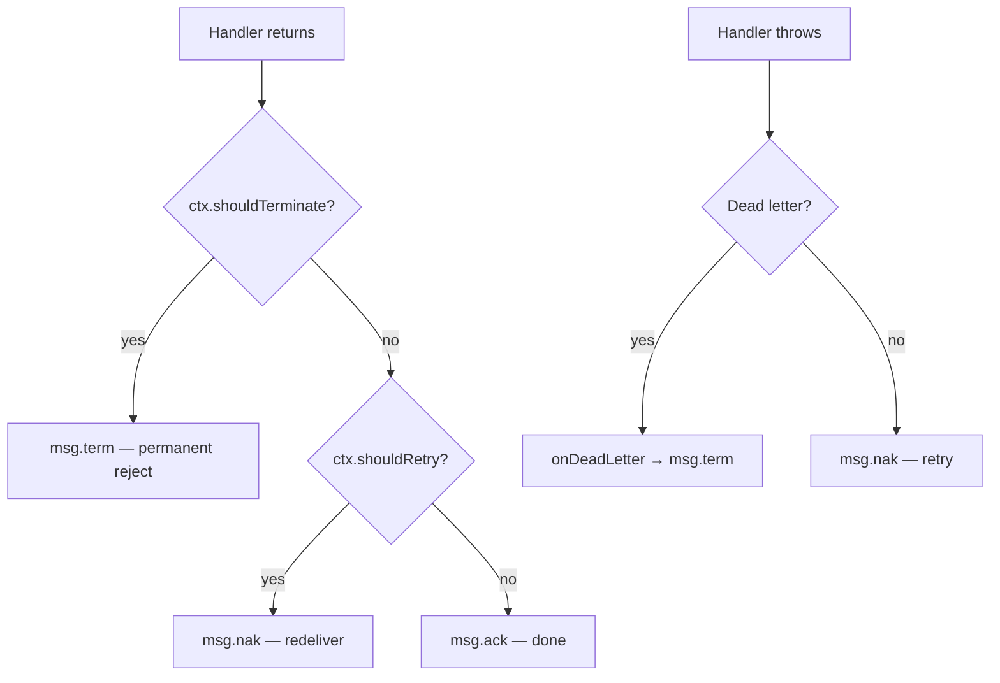

import Since from '@site/src/components/Since';

# Handler Context

Every `@EventPattern` and `@MessagePattern` handler can inject `RpcContext` to access message metadata, JetStream delivery info, and control message settlement. This works identically for both event and RPC handlers.

## Injecting the context

Use the standard NestJS `@Ctx()` decorator:

```typescript
import { Controller } from '@nestjs/common';
import { EventPattern, Payload, Ctx } from '@nestjs/microservices';
import { RpcContext } from '@horizon-republic/nestjs-jetstream';

@Controller()
export class OrdersController {
  @EventPattern('order.created')
  async handleOrderCreated(
    @Payload() data: OrderCreatedDto,
    @Ctx() ctx: RpcContext,
  ) {
    const subject = ctx.getSubject();
    const tenant = ctx.getHeader('x-tenant');
    // ...
  }
}
```

## Methods reference

### Message accessors

| Method | Return type | Description |
|---|---|---|
| `getSubject()` | `string` | The NATS subject this message was published to |
| `getHeader(key)` | `string \| undefined` | Value of a single header, or `undefined` if missing |
| `getHeaders()` | `MsgHdrs \| undefined` | All NATS message headers (the raw NATS `MsgHdrs` object from `@nats-io/transport-node`) |
| `isJetStream()` | `boolean` | Type guard — returns `true` when the message is a JetStream message |
| `getMessage()` | `JsMsg \| Msg` | The raw NATS message (type depends on transport mode) |

### JetStream metadata

<Since version="2.7.0" />

These return `undefined` for Core NATS messages — no type guard needed.

| Method | Return type | Description |
|---|---|---|
| `getDeliveryCount()` | `number \| undefined` | How many times this message has been delivered |
| `getStream()` | `string \| undefined` | The JetStream stream name |
| `getSequence()` | `number \| undefined` | Stream sequence number |
| `getTimestamp()` | `Date \| undefined` | Message publish timestamp |
| `getCallerName()` | `string \| undefined` | Name of the service that sent the message |

### Settlement actions

<Since version="2.7.0" />

Control how the transport acknowledges the message — without throwing errors.

| Method | Effect | Use case |
|---|---|---|
| `ctx.retry({ delayMs? })` | `msg.nak(delayMs)` — redeliver | Business-level retry (external service unavailable, resource locked) |
| `ctx.terminate(reason?)` | `msg.term(reason)` — permanent reject | Message no longer relevant (order cancelled, entity deleted) |
| *(no action)* | `msg.ack()` — acknowledge | Successful processing (default) |

## JetStream metadata

Access delivery info directly without type narrowing:

```typescript
@EventPattern('order.created')
async handle(@Payload() data: OrderCreatedDto, @Ctx() ctx: RpcContext) {
  console.log('Attempt:', ctx.getDeliveryCount());    // 1, 2, 3...
  console.log('Stream:', ctx.getStream());             // 'orders__microservice_ev-stream'
  console.log('Sequence:', ctx.getSequence());         // 42
  console.log('Published:', ctx.getTimestamp());       // Date object
  console.log('From:', ctx.getCallerName());           // 'api-gateway__microservice'
}
```

Use `getDeliveryCount()` for fallback logic on retries:

```typescript
@EventPattern('payment.process')
async handle(@Payload() data: PaymentDto, @Ctx() ctx: RpcContext) {
  if (ctx.getDeliveryCount()! >= 3) {
    // 3rd attempt — try a different payment provider
    await this.fallbackProvider.process(data);
    return;
  }

  await this.primaryProvider.process(data);
}
```

## Controlling message settlement

By default, the transport automatically acks on success and naks on error. Use `retry()` and `terminate()` to override this without throwing:

### Business retry

When conditions aren't right to process the message now, but will be later:

```typescript
@EventPattern('order.fulfill')
async handle(@Payload() data: FulfillDto, @Ctx() ctx: RpcContext) {
  if (!await this.inventoryService.isAvailable()) {
    ctx.retry({ delayMs: 30_000 }); // try again in 30 seconds
    return;
  }

  await this.fulfillOrder(data);
  // auto-ack — no flags set
}
```

Without `delayMs`, the message is redelivered immediately:

```typescript
ctx.retry(); // immediate redelivery
```

### Terminate

When the message is no longer relevant and should not be retried or sent to DLQ:

```typescript
@EventPattern('order.process')
async handle(@Payload() data: OrderDto, @Ctx() ctx: RpcContext) {
  const order = await this.orderService.find(data.orderId);

  if (order.status === 'cancelled') {
    ctx.terminate('Order already cancelled');
    return;
  }

  await this.process(order);
}
```

### Settlement decision flow



:::warning Mutual exclusivity
`retry()` and `terminate()` cannot both be called in the same handler — the second call throws an `Error`. Choose one intent per message.
:::

:::info Scope
Settlement actions only affect **JetStream event handlers** (workqueue and broadcast). They have no effect on ordered events (auto-acknowledged) or RPC handlers (separate settlement logic).
:::

## Extracting custom headers

Headers set via [`JetstreamRecordBuilder.setHeader()`](./record-builder.md) are available through `getHeader()`:

```typescript title="Publisher"
const record = new JetstreamRecordBuilder(data)
  .setHeader('x-tenant', 'acme')
  .setHeader('x-trace-id', crypto.randomUUID())
  .build();

await lastValueFrom(this.client.emit('order.created', record));
```

```typescript title="Handler"
@EventPattern('order.created')
async handle(@Payload() data: OrderCreatedDto, @Ctx() ctx: RpcContext) {
  const tenant = ctx.getHeader('x-tenant');     // 'acme'
  const traceId = ctx.getHeader('x-trace-id');  // uuid string
  const missing = ctx.getHeader('x-unknown');    // undefined
}
```

## The `isJetStream()` type guard

`RpcContext` can wrap either a JetStream message (`JsMsg`) or a Core NATS message (`Msg`). The `isJetStream()` method narrows the return type of `getMessage()`:

```typescript
if (ctx.isJetStream()) {
  const msg = ctx.getMessage(); // TypeScript knows this is JsMsg
  console.log('Redelivered:', msg.redelivered);
}
```

:::info When is it not JetStream?
This check is useful when writing code that works across both Core RPC mode (`Msg`) and JetStream mode (`JsMsg`). The new metadata getters (`getDeliveryCount()`, etc.) already handle this internally — they return `undefined` for Core messages.
:::

## Accessing the raw NATS message

For advanced use cases, `getMessage()` gives direct access to the underlying NATS message object. Prefer the typed accessors when possible.

```typescript
if (ctx.isJetStream()) {
  const msg = ctx.getMessage();
  console.log('Pending:', msg.info.pending);
  console.log('Stream sequence:', msg.info.streamSequence);
}
```

:::warning Manual acknowledgment
Calling `msg.ack()`, `msg.nak()`, or `msg.term()` directly bypasses the transport's settlement logic. Use `ctx.retry()` and `ctx.terminate()` instead — they integrate with ack extension, dead letter handling, and observability hooks.
:::

## See also

- [Record Builder & Deduplication](./record-builder.md) — set custom headers and message IDs on the publisher side
- [Custom Codec](./custom-codec.md) — control how the `@Payload()` data is serialized and deserialized
- [Dead Letter Queue](./dead-letter-queue.md) — what happens when retries are exhausted
- [Troubleshooting](./troubleshooting.md) — common issues with message delivery
