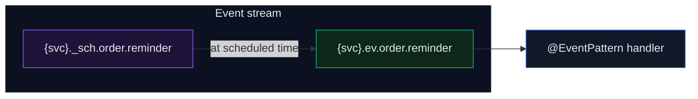

import Since from '@site/src/components/Since';

# Scheduling (Delayed Jobs)

<Since version="2.8.0" />

One-shot delayed message delivery powered by [NATS 2.12 message scheduling](https://github.com/nats-io/nats-architecture-and-design/blob/main/adr/ADR-51.md) (ADR-51).

Publish an event now, have it delivered to the consumer at a future time. Replaces the need for external schedulers like Bull or Agenda for simple delayed jobs.

## Requirements

- **NATS Server >= 2.12**
- `allow_msg_schedules: true` on the event stream

## Configuration

Enable message scheduling on the event stream:

```typescript
JetstreamModule.forRoot({
  name: 'orders',
  servers: ['nats://localhost:4222'],
  events: {
    stream: { allow_msg_schedules: true },
  },
});
```

This flag is not enabled by default to maintain backward compatibility with NATS < 2.12. It can be safely added to existing streams — NATS applies it as a regular update without recreation or downtime.

## Usage

Use `scheduleAt()` on `JetstreamRecordBuilder` to delay delivery:

```typescript
import { JetstreamRecordBuilder } from '@horizon-republic/nestjs-jetstream';
import { lastValueFrom } from 'rxjs';

// Deliver in 1 hour
const record = new JetstreamRecordBuilder({ orderId: 42, type: 'reminder' })
  .scheduleAt(new Date(Date.now() + 60 * 60 * 1000))
  .build();

await lastValueFrom(this.client.emit('order.reminder', record));
```

The consumer handles it like any normal event — no changes needed on the receiving side:

```typescript
@EventPattern('order.reminder')
handleReminder(@Payload() data: OrderReminder) {
  // Executed at the scheduled time
}
```

## How it works

1. `scheduleAt(date)` stores the delivery time in the record
2. On publish, the library routes to a `_sch` subject within the event stream (a library convention to separate scheduled messages from regular events)
3. The publish includes `Nats-Schedule` and `Nats-Schedule-Target` headers (ADR-51) — the server uses these headers, not the subject, to manage scheduling
4. NATS holds the message until the scheduled time, then publishes a **new message** to the target event subject
5. The event consumer processes it normally



## Important: `max_age` consideration

Scheduled messages are stored in the event stream like any other message. If the stream's `max_age` expires before the scheduled delivery time, **NATS silently purges the message** — no delivery, no error.

The default event stream `max_age` is **7 days**. If you need to schedule messages further in the future, increase `max_age`:

```typescript
events: {
  stream: {
    allow_msg_schedules: true,
    max_age: 0, // no expiry — use when scheduling beyond 7 days
  },
},
```

:::caution
Setting `max_age: 0` disables automatic cleanup for **all** messages in the event stream, not just scheduled ones. Consider the storage implications for high-throughput streams.
:::

## Limitations

| Limitation | Details |
|-----------|---------|
| **One-shot only** | No cron or interval scheduling. NATS supports these (ADR-51), but the library currently only exposes `scheduleAt()` for one-shot delivery. |
| **Events only** | `scheduleAt()` is ignored for RPC (`client.send()`); a warning is logged |
| **Future dates only** | `scheduleAt()` throws if the date is not in the future |
| **NATS >= 2.12** | `allow_msg_schedules` is not supported by older server versions |
| **`max_age` constraint** | Schedule delay must not exceed the stream's `max_age` |
| **Per-stream opt-in** | Broadcast scheduling requires `allow_msg_schedules: true` on the broadcast stream config separately |
