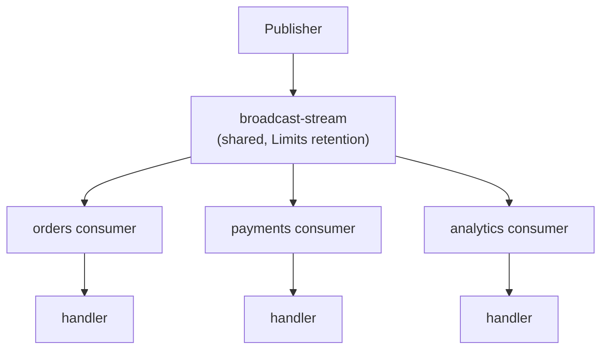
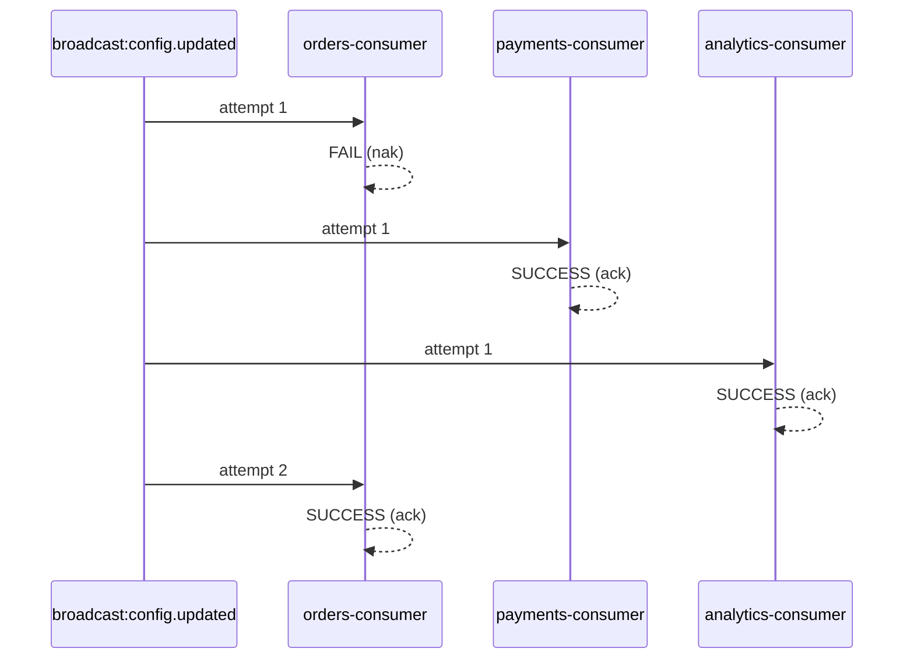

# Broadcast Events

Broadcast events implement **fan-out** delivery: every subscribing service receives a copy of each message. This is the opposite of [workqueue events](/docs/patterns/events), where only one instance processes each message.

## When to use

Imagine a multi-service platform where an admin updates a feature flag. Every service — orders, payments, notifications, analytics — must refresh its local cache immediately. You don't want to call each service individually, and you don't want only one instance to get the update.

Broadcast events solve this. When you publish a broadcast event, every service that has registered a handler receives the message independently.

## How it works

The broadcast flow, step by step:

1. **Publish** — a service calls `client.emit('broadcast:config.updated', data)`. The `broadcast:` prefix tells the transport this is a fan-out event.
2. **Route** — the transport publishes to the subject `broadcast.config.updated` (a global subject, not scoped to any service).
3. **Shared stream** — the message is persisted in a single **shared** `broadcast-stream` with **Limits** retention (messages are kept even after acknowledgement, up to the configured limits).
4. **Per-service consumers** — each service that registered a `{ broadcast: true }` handler has its own durable consumer on the shared stream. Every consumer independently receives the message.
5. **Dispatch** — each service's `EventRouter` decodes the payload and invokes the matching handler.
6. **Acknowledge** — each consumer acks or naks independently.



:::info Limits vs. Workqueue retention
The broadcast stream uses **Limits** retention, not Workqueue. Messages are not deleted after acknowledgement — they stay in the stream until they exceed `max_age`, `max_msgs`, or `max_bytes`. This allows new consumers to replay historical broadcasts.
:::

## Code examples

### Sending broadcast events

Use `client.emit()` with the `broadcast:` prefix on the pattern. The prefix is only used on the sending side to route the message to the broadcast stream.

```typescript title="src/admin/admin.service.ts"
import { Inject, Injectable } from '@nestjs/common';
import { ClientProxy } from '@nestjs/microservices';
import { lastValueFrom } from 'rxjs';

@Injectable()
export class AdminService {
  constructor(
    @Inject('admin') private readonly client: ClientProxy,
  ) {}

  async updateFeatureFlag(key: string, enabled: boolean): Promise<void> {
    await this.featureFlagRepository.update(key, enabled);

    // Notify ALL services to refresh their cache
    await lastValueFrom(
      this.client.emit('broadcast:feature-flag.updated', { key, enabled }),
    );
  }

  async updateConfig(key: string, value: string): Promise<void> {
    await this.configRepository.update(key, value);

    await lastValueFrom(
      this.client.emit('broadcast:config.updated', { key, value }),
    );
  }
}
```

### Handling broadcast events

Use `@EventPattern` with `{ broadcast: true }` in the extras object. The pattern itself does **not** include the `broadcast:` prefix — that's only for the sending side.

```typescript title="src/orders/orders.controller.ts"
import { Controller, Logger } from '@nestjs/common';
import { EventPattern, Payload } from '@nestjs/microservices';

@Controller()
export class OrdersController {
  private readonly logger = new Logger(OrdersController.name);
  private configCache = new Map<string, string>();

  @EventPattern('config.updated', { broadcast: true })
  handleConfigUpdated(@Payload() data: { key: string; value: string }): void {
    this.logger.log(`Config changed: ${data.key} = ${data.value}`);
    this.configCache.set(data.key, data.value);
  }

  @EventPattern('feature-flag.updated', { broadcast: true })
  handleFeatureFlag(@Payload() data: { key: string; enabled: boolean }): void {
    this.logger.log(`Feature flag ${data.key}: ${data.enabled}`);
    this.featureFlagService.refresh(data.key, data.enabled);
  }
}
```

```typescript title="src/payments/payments.controller.ts"
import { Controller, Logger } from '@nestjs/common';
import { EventPattern, Payload } from '@nestjs/microservices';

@Controller()
export class PaymentsController {
  private readonly logger = new Logger(PaymentsController.name);

  @EventPattern('config.updated', { broadcast: true })
  handleConfigUpdated(@Payload() data: { key: string; value: string }): void {
    this.logger.log(`Payments refreshing config: ${data.key}`);
    this.configService.reload(data.key, data.value);
  }
}
```

Both `OrdersController` and `PaymentsController` receive the same `config.updated` message independently — each through their own durable consumer.

:::warning Asymmetric prefixing
The `broadcast:` prefix is used **only on the sending side** (`client.emit('broadcast:config.updated', ...)`). On the handler side, the pattern is just `'config.updated'` with `{ broadcast: true }` in extras. This asymmetry is intentional — the prefix controls routing, while the extras flag controls consumer registration.
:::

## Delivery semantics

Each consumer processes broadcast messages with the same delivery guarantees as workqueue events:

| Scenario | Action | Effect |
|---|---|---|
| Handler succeeds | `ack` | Consumer marked as having processed the message |
| Handler throws an error | `nak` | Message redelivered to **that consumer only** |
| Payload cannot be decoded | `term` | Message terminated for that consumer |
| No handler for subject | `term` | Message terminated for that consumer |
| Max deliveries exhausted | `term` | Dead letter callback invoked for that consumer |

The key difference from workqueue events: broadcast delivery is **at-least-once per consumer**. Every subscribing service receives every message at least once.

## Per-service isolation

This is the most important concept to understand about broadcast events: **each service's consumer is completely independent**.

If the orders service fails to process a broadcast message and the message is nak'd:
- Only the orders service's consumer retries the message.
- The payments service and analytics service are **completely unaffected**.
- Each consumer tracks its own delivery count independently.



This means:
- A bug in one service does not block message delivery to other services.
- Dead letter tracking is per-consumer: the orders service can exhaust its retries while payments processes normally.
- Each service can be deployed, restarted, or scaled independently.

## Shared stream, per-service consumers

The broadcast system has two configuration layers with different scopes:

### Stream-level config (shared)

The `broadcast-stream` is **shared across all services**. Stream-level settings affect everyone:

```typescript
// In ANY service's forRoot() -- affects the shared broadcast-stream
JetstreamModule.forRoot({
  name: 'orders',
  servers: ['nats://localhost:4222'],
  broadcast: {
    stream: {
      max_age: toNanos(48, 'hours'), // Keep broadcasts for 48 hours
      max_bytes: 5 * 1024 * 1024 * 1024,   // 5 GB limit
    },
  },
}),
```

:::warning Stream config is global
Since all services share the same `broadcast-stream`, any service can update the stream config on startup. The last service to start wins. Coordinate stream-level settings across your team, or let a single "infrastructure" service own them.
:::

### Consumer-level config (per-service)

Each service creates its own durable consumer (named `{service}__microservice_broadcast-consumer`). Consumer settings are scoped to that service:

```typescript
// In the orders service -- only affects the orders broadcast consumer
JetstreamModule.forRoot({
  name: 'orders',
  servers: ['nats://localhost:4222'],
  broadcast: {
    consumer: {
      max_deliver: 5,              // Orders service retries 5 times
      ack_wait: toNanos(30, 'seconds'),  // 30s timeout for orders handlers
    },
  },
}),
```

```typescript
// In the payments service -- only affects the payments broadcast consumer
JetstreamModule.forRoot({
  name: 'payments',
  servers: ['nats://localhost:4222'],
  broadcast: {
    consumer: {
      max_deliver: 10,             // Payments retries 10 times
      ack_wait: toNanos(60, 'seconds'),  // 60s timeout for payment handlers
    },
  },
}),
```

Each consumer only subscribes to the broadcast subjects it has handlers for (via `filter_subject` or `filter_subjects`), so services only receive the broadcast events they care about.

### Default values reference

**Stream defaults (shared):**

| Setting | Default | Description |
|---|---|---|
| `retention` | `Limits` | Messages kept until limits exceeded |
| `storage` | `File` | Persistent file-based storage |
| `max_msg_size` | 10 MB | Maximum size per message |
| `max_msgs` | 10,000,000 | Maximum total messages |
| `max_bytes` | 2 GB | Maximum total stream size |
| `max_age` | 1 day | Messages older than this are purged |
| `duplicate_window` | 2 minutes | Window for publish-side deduplication |

**Consumer defaults (per-service):**

| Setting | Default | Description |
|---|---|---|
| `ack_policy` | `Explicit` | Handler must ack/nak each message |
| `ack_wait` | 10 seconds | Time before unacked message is redelivered |
| `max_deliver` | 3 | Maximum delivery attempts before dead letter |
| `max_ack_pending` | 100 | Maximum unacknowledged messages in flight |

## Common use cases

### Configuration propagation

When a centralized config service updates a value, all services must pick up the change:

```typescript
// Publisher
this.client.emit('broadcast:config.updated', {
  key: 'rate-limit.max-requests',
  value: '1000',
  updatedAt: new Date().toISOString(),
});
```

### Cache invalidation

When the source of truth changes, all services holding a cached copy must invalidate:

```typescript
// Publisher
this.client.emit('broadcast:cache.invalidate', {
  entity: 'product',
  id: productId,
  reason: 'price-updated',
});

// Handler (in any service that caches products)
@EventPattern('cache.invalidate', { broadcast: true })
handleCacheInvalidation(@Payload() data: CacheInvalidationEvent): void {
  if (data.entity === 'product') {
    this.productCache.delete(data.id);
  }
}
```

### Feature flag toggles

When a feature flag changes, every service instance must update its local state:

```typescript
// Publisher
this.client.emit('broadcast:feature-flag.updated', {
  key: 'new-checkout-flow',
  enabled: true,
  rolloutPercentage: 25,
});

// Handler
@EventPattern('feature-flag.updated', { broadcast: true })
handleFeatureFlag(@Payload() data: FeatureFlagEvent): void {
  this.featureFlags.set(data.key, {
    enabled: data.enabled,
    rollout: data.rolloutPercentage,
  });
}
```

## What's next?

- [**Events (Workqueue)**](/docs/patterns/events) — single-consumer event delivery
- [**Dead Letter Queue**](/docs/guides/dead-letter-queue) — handle messages that exhaust all retries
- [**Lifecycle Hooks**](/docs/guides/lifecycle-hooks) — observe transport events like dead letters and message routing
- [**Module Configuration**](/docs/getting-started/module-configuration) — full reference for stream and consumer options
