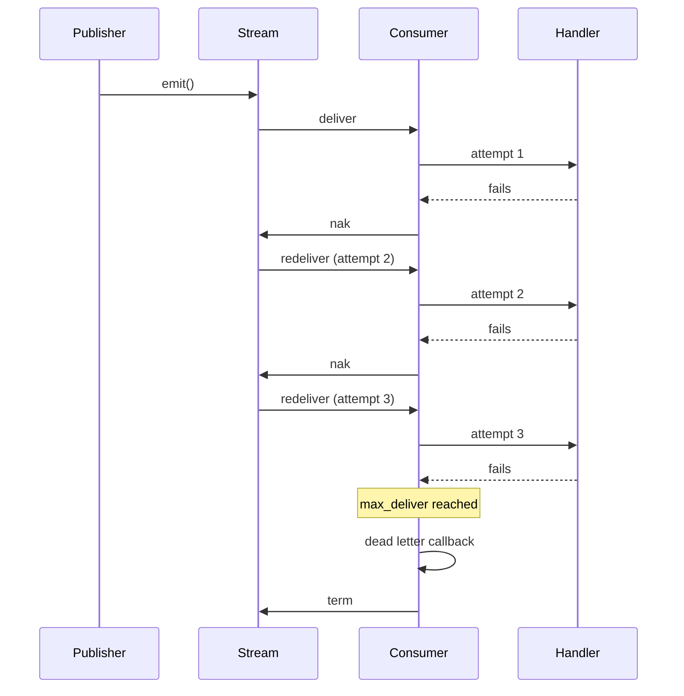

# Events (Workqueue)

Workqueue events are fire-and-forget messages where **exactly one** handler instance processes each message. This is the default event delivery model in nestjs-jetstream.

## When to use

Imagine an e-commerce system: an order is created, and you need to send a confirmation email, update inventory, and notify the warehouse. Each of these tasks should happen **once** — you don't want three instances of the email service each sending the same confirmation.

Workqueue events solve this. When you publish an event, NATS JetStream delivers it to a single consumer in the group. If that consumer fails, the message is redelivered to another instance. If all retries are exhausted, the message is routed to a dead letter queue for investigation.

## How it works

The workqueue flow, step by step:

1. **Publish** — a service calls `client.emit('order.created', data)`.
2. **Route** — the transport publishes to the JetStream subject `{service}__microservice.ev.order.created`.
3. **Stream** — the message is persisted in the service's event stream (workqueue retention).
4. **Consume** — one durable pull consumer picks up the message from the stream.
5. **Dispatch** — the `EventRouter` decodes the payload and invokes the matching `@EventPattern` handler.
6. **Acknowledge** — on success, the message is `ack`'d and removed from the stream. On failure, it is `nak`'d for redelivery.

Because the stream uses **workqueue retention**, a message is automatically deleted once acknowledged — keeping the stream compact.

:::info Parallel handler execution
Workqueue event handlers run concurrently using RxJS `mergeMap`. Multiple messages can be processed in parallel, limited by the consumer's `max_ack_pending` setting (default: 100).
:::

## Code examples

### Sending events

Use the standard NestJS `ClientProxy.emit()` method. No prefix is needed for workqueue events.

```typescript title="src/orders/orders.service.ts"
import { Inject, Injectable } from '@nestjs/common';
import { ClientProxy } from '@nestjs/microservices';
import { lastValueFrom } from 'rxjs';

@Injectable()
export class OrdersService {
  constructor(
    @Inject('orders') private readonly client: ClientProxy,
  ) {}

  async createOrder(dto: CreateOrderDto): Promise<Order> {
    const order = await this.orderRepository.save(dto);

    // Fire-and-forget: at-least-once delivery via JetStream
    await lastValueFrom(
      this.client.emit('order.created', {
        orderId: order.id,
        customerId: order.customerId,
        total: order.total,
      }),
    );

    return order;
  }
}
```

### Handling events

Use `@EventPattern` with no extras. The handler return value is ignored.

```typescript title="src/notifications/notifications.controller.ts"
import { Controller, Logger } from '@nestjs/common';
import { EventPattern, Payload } from '@nestjs/microservices';

@Controller()
export class NotificationsController {
  private readonly logger = new Logger(NotificationsController.name);

  @EventPattern('order.created')
  async handleOrderCreated(
    @Payload() data: { orderId: number; customerId: string; total: number },
  ): Promise<void> {
    this.logger.log(`Sending confirmation for order ${data.orderId}`);
    await this.emailService.sendOrderConfirmation(data);
  }
}
```

:::tip Handler errors trigger retry
If `handleOrderCreated` throws an exception, the message is automatically `nak`'d and redelivered. You don't need try/catch for retry logic — the transport handles it.
:::

## Delivery semantics

The transport uses explicit acknowledgement. The outcome depends on what happens during message processing:

| Scenario | Action | Effect |
|---|---|---|
| Handler succeeds | `ack` | Message removed from stream |
| Handler throws an error | `nak` | Message redelivered after backoff |
| Payload cannot be decoded | `term` | Message terminated (no retry) |
| No handler registered for subject | `term` | Message terminated (no retry) |
| Max deliveries exhausted | `term` | Dead letter callback invoked, then terminated |

:::warning Decode errors are terminal
If the codec cannot deserialize a message (e.g., corrupted data, schema mismatch), the message is immediately terminated with `term()`. Retrying would produce the same error, so the transport avoids wasting delivery attempts.
:::

## Retry flow

When a handler throws an error, the following retry sequence occurs:

1. The message is `nak`'d, signaling NATS to redeliver it.
2. NATS redelivers the message to an available consumer instance.
3. If the handler fails again, step 1-2 repeat up to `max_deliver` times (default: **3**).
4. On the final delivery attempt, if the handler still fails, the transport detects that `deliveryCount >= max_deliver` and treats the message as a **dead letter**.
5. The `onDeadLetter` callback is invoked (if configured), then the message is terminated with `term()`.



If the `onDeadLetter` callback itself fails, the message is `nak`'d one more time, giving the dead letter hook another chance on the next cycle.

For full details on dead letter handling, see the [Dead Letter Queue](/docs/guides/dead-letter-queue) guide.

## Idempotency

Because the transport provides **at-least-once** delivery, a handler may receive the same message more than once — for example, if the service crashes after processing but before acknowledging. Your handlers must be **idempotent**: processing the same message twice should produce the same result.

### Practical patterns

**Database upsert** — use a unique constraint or `ON CONFLICT` clause so re-processing the same event doesn't create duplicates:

```typescript
@EventPattern('order.created')
async handleOrderCreated(@Payload() data: OrderCreatedEvent): Promise<void> {
  // Upsert: if this orderId already exists, the insert is a no-op
  await this.db.query(
    `INSERT INTO processed_orders (order_id, status)
     VALUES ($1, $2)
     ON CONFLICT (order_id) DO NOTHING`,
    [data.orderId, 'confirmed'],
  );
}
```

**Idempotency key** — track processed message IDs in a cache or database:

```typescript
@EventPattern('payment.completed')
async handlePayment(@Payload() data: PaymentEvent, @Ctx() ctx: RpcContext): Promise<void> {
  const msg = ctx.getMessage() as JsMsg;
  const dedupKey = `payment:${msg.info.stream}:${msg.info.streamSequence}`;

  if (await this.cache.exists(dedupKey)) {
    return; // Already processed
  }

  await this.processPayment(data);
  await this.cache.set(dedupKey, '1', { ttl: 86400 });
}
```

## Message deduplication

NATS JetStream has built-in **publish-side deduplication**. If two messages with the same `messageId` arrive within the stream's `duplicate_window`, the second publish is silently dropped.

Use `JetstreamRecordBuilder` to set a deterministic message ID:

```typescript
import { JetstreamRecordBuilder } from '@horizon-republic/nestjs-jetstream';
import { lastValueFrom } from 'rxjs';

const record = new JetstreamRecordBuilder({
  orderId: order.id,
  total: order.total,
})
  .setMessageId(`order-created-${order.id}`)
  .build();

await lastValueFrom(this.client.emit('order.created', record));
```

This prevents duplicate publishes in scenarios like:

- The publisher retries after a network timeout (but the first publish actually succeeded).
- A controller endpoint is called twice with the same data.

:::info Dedup window defaults
The event stream's default `duplicate_window` is **2 minutes**. Messages with the same ID published within this window are deduplicated. If you need a longer window, override it in the stream config (see [Custom configuration](#custom-configuration) below).
:::

When no message ID is set explicitly, the transport generates a random UUID for each publish — meaning no deduplication occurs by default. Always set a deterministic message ID when duplicate publishes are a concern.

## Custom configuration

### Stream overrides

The event stream is created with sensible defaults. Override them in `forRoot()` under `events.stream`:

```typescript
JetstreamModule.forRoot({
  name: 'orders',
  servers: ['nats://localhost:4222'],
  events: {
    stream: {
      max_age: toNanos(14, 'days'), // 14 days instead of 7
      max_bytes: 10 * 1024 * 1024 * 1024,        // 10 GB instead of 5 GB
      duplicate_window: toNanos(5, 'minutes'),     // 5 min dedup window instead of 2 min
    },
  },
}),
```

### Consumer overrides

Override consumer settings under `events.consumer`:

```typescript
JetstreamModule.forRoot({
  name: 'orders',
  servers: ['nats://localhost:4222'],
  events: {
    consumer: {
      max_deliver: 5,              // 5 retries instead of 3
      ack_wait: toNanos(30, 'seconds'),  // 30s ack timeout instead of 10s
      max_ack_pending: 50,         // Limit in-flight messages to 50
    },
  },
}),
```

:::tip When to increase ack_wait
If your handler calls a slow external API (e.g., sending emails, processing payments), increase `ack_wait` so that NATS doesn't redeliver the message before your handler finishes. The default is 10 seconds — long-running handlers may need 30s or more.
:::

:::tip When to increase max_deliver
The default of 3 delivery attempts works well for transient errors (network blips, temporary database unavailability). Increase it to 5 or higher if your handlers interact with unreliable external services where intermittent failures are common.
:::

### Default values reference

**Stream defaults:**

| Setting | Default | Description |
|---|---|---|
| `retention` | `Workqueue` | Messages deleted after ack |
| `storage` | `File` | Persistent file-based storage |
| `max_msg_size` | 10 MB | Maximum size per message |
| `max_msgs` | 50,000,000 | Maximum total messages in stream |
| `max_bytes` | 5 GB | Maximum total stream size |
| `max_age` | 7 days | Messages older than this are purged |
| `duplicate_window` | 2 minutes | Window for publish-side deduplication |

**Consumer defaults:**

| Setting | Default | Description |
|---|---|---|
| `ack_policy` | `Explicit` | Handler must ack/nak each message |
| `ack_wait` | 10 seconds | Time before unacked message is redelivered |
| `max_deliver` | 3 | Maximum delivery attempts before dead letter |
| `max_ack_pending` | 100 | Maximum unacknowledged messages in flight |
| `deliver_policy` | `All` | Deliver all available messages |

## Error handling

When a handler throws, the transport automatically `nak`'s the message for redelivery. For most cases, this is all you need. However, some errors are **non-recoverable** — retrying will never succeed. For these, use `ctx.terminate()` to permanently discard the message.

```typescript title="src/orders/orders.controller.ts"
import { Controller, Logger } from '@nestjs/common';
import { Ctx, EventPattern, Payload } from '@nestjs/microservices';
import { RpcContext } from '@horizon-republic/nestjs-jetstream';

@Controller()
export class OrdersController {
  private readonly logger = new Logger(OrdersController.name);

  @EventPattern('order.process')
  async handleOrder(
    @Payload() data: OrderPayload,
    @Ctx() ctx: RpcContext,
  ): Promise<void> {
    try {
      await this.ordersService.process(data);
      // Success — ack is called automatically by the transport
    } catch (error) {
      if (this.isNonRecoverable(error)) {
        // Non-recoverable: invalid payload, business rule violation, etc.
        // ctx.terminate() prevents redelivery — the message is permanently discarded.
        ctx.terminate('Non-recoverable: ' + error.message);
        this.logger.error(`Permanently discarding order`, error);
        return;
      }

      // Recoverable errors (DB timeout, external API down, etc.):
      // Re-throw — the transport calls nak automatically,
      // triggering redelivery after ack_wait.
      // After max_deliver attempts, onDeadLetter is invoked.
      throw error;
    }
  }

  private isNonRecoverable(error: unknown): boolean {
    return error instanceof ValidationError
      || error instanceof BusinessRuleViolation;
  }
}
```

### Message settlement outcomes

Every message ends in one of three states:

| Outcome | When | Effect |
|---------|------|--------|
| **`ctx.ack()`** | Handler succeeds | Message removed from stream. Called automatically by the transport on success. |
| **`ctx.retry()`** | Recoverable error | Message redelivered (optionally with `{ delayMs }` delay). Called automatically when the handler throws. |
| **`ctx.terminate(reason)`** | Non-recoverable error | Message permanently discarded. Must be called manually in the handler. |

### Relationship with dead letter handling

When a message is `nak`'d repeatedly and reaches the `max_deliver` limit (default: 3), the transport treats it as a dead letter:

1. The `onDeadLetter` callback is invoked (if configured) with full message context.
2. The message is terminated with `term()`.

This means `msg.term()` is for errors you **know** will never succeed (validation failures, schema mismatches), while `throw` is for errors that **might** succeed on retry (timeouts, temporary unavailability). For messages that exhaust all retries, the dead letter mechanism provides a safety net.

See the [Dead Letter Queue](/docs/guides/dead-letter-queue) guide for how to configure and handle dead letters.

## What's next?

- [**Broadcast Events**](/docs/patterns/broadcast) — fan-out delivery to all service instances
- [**Dead Letter Queue**](/docs/guides/dead-letter-queue) — handle messages that exhaust all retries
- [**Record Builder**](/docs/guides/record-builder) — attach custom headers and message IDs
- [**Lifecycle Hooks**](/docs/guides/lifecycle-hooks) — observe transport events like dead letters and message routing
- [**Performance Tuning**](/docs/guides/performance) — concurrency, ack extension, and backpressure
- [**Troubleshooting**](/docs/guides/troubleshooting#consumer-issues) — diagnosing delivery and redelivery issues
