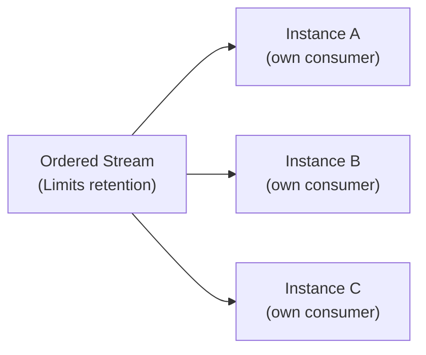

import Since from '@site/src/components/Since';

<Since version="2.4.0" />

# Ordered Events

## The problem: rebuilding state from event history

Imagine you're building an e-commerce platform. Every time an order changes status — created, paid, shipped, delivered — you publish an event. Downstream, a projections service rebuilds a read model (an Elasticsearch index, a Redis cache, a reporting database) from these events.

Here's the catch: **order matters**. If the projections service processes "delivered" before "shipped", your read model is wrong. If it processes "paid" before "created", you get a foreign key violation. And if a message is lost, your projection diverges silently from reality.

Standard [workqueue events](/docs/patterns/events) don't help here — they're designed for parallel processing and load balancing, not for sequential replay. You need a messaging primitive that guarantees:

1. **Strict ordering** — messages arrive in exactly the sequence they were published
2. **Full replay** — new instances can catch up from the beginning of the stream
3. **Per-instance delivery** — each service instance gets its own independent view of the stream

This is what ordered events provide.

## How ordered consumers work

Under the hood, ordered events use a fundamentally different NATS JetStream primitive than workqueue or broadcast events. Understanding these differences is key to using them correctly.

### Ephemeral, not durable

Workqueue and broadcast events use **durable consumers** — server-side state that tracks which messages have been acknowledged. Ordered events use **ordered consumers**, which are ephemeral. There is no server-side consumer state. The `@nats-io/jetstream` client creates a new consumer on each connection and manages its lifecycle internally.

This means:
- No consumer name appears in `nats consumer ls`
- No ack tracking, no pending message state
- If the connection drops, the client recreates the consumer automatically at the correct sequence position

### Limits retention, not Workqueue

The ordered stream uses **Limits retention** (`RetentionPolicy.Limits`), not Workqueue retention. This is a critical distinction:

| | Workqueue retention | Limits retention |
|---|---|---|
| Message lifecycle | Deleted after acknowledgment | Kept until age/size limits |
| Multiple readers | Compete for messages | Each reads independently |
| Replay possible | No (messages are gone after ack) | Yes (messages persist) |
| Default `max_age` | 7 days | **1 day** |

With Limits retention, messages stay in the stream until they expire (default: 1 day, configurable via `max_age`). Every consumer — and every service instance — can read the full history independently.

### Auto-acknowledgment

The `@nats-io/jetstream` client automatically acknowledges messages from ordered consumers. Your handler code never calls `msg.ack()` or `msg.nak()`. This is not optional — it's baked into the ordered consumer protocol.

### Self-healing

The transport wraps the ordered consumer in a `defer()` + `repeat()` loop with exponential backoff. If the consumer disconnects (NATS restart, network partition, etc.), it automatically re-establishes after a short delay. The backoff starts at 100ms and caps at 30 seconds. See [Self-healing consumers](/docs/reference/edge-cases#consumer-self-healing) for the full recovery flow that applies to all consumer types.

## At-most-once delivery semantics

Ordered consumers provide **at-most-once** delivery. This is the fundamental trade-off for strict ordering: you get guaranteed order, but you lose automatic retries.

### What happens when things go wrong

| Scenario | What happens | Message retried? |
|---|---|---|
| Handler succeeds | Auto-ack by the client | No |
| Handler throws an error | Error logged, consumer moves to next message | **No** |
| Decode error (malformed payload) | Error logged, message skipped | **No** |
| No handler registered for subject | Error logged, message skipped | **No** |

### Why no retries?

Retrying a failed message would block all subsequent messages (since ordering must be preserved), creating a head-of-line blocking problem. A single poison message could halt your entire pipeline. Instead, the transport logs the error and moves on.

:::warning Handler errors are silent from a delivery perspective
If your handler throws, the message is gone. The ordered consumer does not support `nak()`, `term()`, or any form of negative acknowledgment. Design your handlers to be defensive — catch errors internally if you need to persist failures to a dead letter table or retry queue.
:::

### Sequential processing with concatMap

The transport routes ordered messages through RxJS `concatMap`, not `mergeMap`. This means:

- Messages are processed **one at a time**, in order
- The next message waits until the current handler completes (or fails)
- No concurrent handler execution within a single instance

This is different from workqueue and broadcast events, which use `mergeMap` for parallel processing.

## Sending and receiving ordered events

### Publishing events

Use the `ordered:` prefix when emitting events through a `JetstreamClient`:

```typescript title="src/orders/orders.service.ts"
import { Inject, Injectable } from '@nestjs/common';
import { ClientProxy } from '@nestjs/microservices';
import { lastValueFrom } from 'rxjs';

@Injectable()
export class OrdersService {
  constructor(
    @Inject('orders') private readonly client: ClientProxy,
  ) {}

  async shipOrder(orderId: number) {
    // The 'ordered:' prefix routes to the ordered stream
    await lastValueFrom(
      this.client.emit('ordered:order.status', {
        orderId,
        status: 'shipped',
        timestamp: new Date().toISOString(),
      }),
    );
  }
}
```

The `ordered:` prefix is stripped during subject construction. The actual NATS subject becomes `{name}__microservice.ordered.order.status`.

:::info The prefix is a routing directive, not part of the subject
When you emit `'ordered:order.status'`, the client strips the `ordered:` prefix and publishes to the ordered stream. On the handler side, you register for `'order.status'` (without the prefix) using the `{ ordered: true }` extras flag.
:::

### Handling events

Register handlers with `@EventPattern` and `{ ordered: true }` in the extras parameter:

```typescript title="src/projections/projections.controller.ts"
import { Controller } from '@nestjs/common';
import { EventPattern, Payload, Ctx } from '@nestjs/microservices';
import { RpcContext } from '@horizon-republic/nestjs-jetstream';

@Controller()
export class ProjectionsController {
  constructor(private readonly projectionService: ProjectionService) {}

  @EventPattern('order.status', { ordered: true })
  async handleOrderStatus(
    @Payload() data: OrderStatusDto,
    @Ctx() ctx: RpcContext,
  ) {
    // Messages arrive in strict publish order
    // Process sequentially -- no concurrent calls to this handler
    await this.projectionService.applyStatusChange(data);
  }

  @EventPattern('order.created', { ordered: true })
  async handleOrderCreated(@Payload() data: OrderCreatedDto) {
    await this.projectionService.createProjection(data);
  }
}
```

### Complete example: CQRS read model

```typescript title="src/app.module.ts"
import { Module } from '@nestjs/common';
import { JetstreamModule, toNanos } from '@horizon-republic/nestjs-jetstream';

@Module({
  imports: [
    JetstreamModule.forRoot({
      name: 'projections',
      servers: ['nats://localhost:4222'],
      ordered: {
        // Replay all events from the stream on startup
        // (default behavior -- included for clarity)
        stream: {
          max_age: toNanos(7, 'days'), // 7 days of history
        },
      },
    }),
    JetstreamModule.forFeature({ name: 'projections' }),
  ],
})
export class AppModule {}
```

```typescript title="src/writer/writer.service.ts"
import { lastValueFrom } from 'rxjs';

@Injectable()
export class WriterService {
  constructor(@Inject('projections') private readonly client: ClientProxy) {}

  async recordEvent(event: DomainEvent) {
    // Publish to the ordered stream
    await lastValueFrom(
      this.client.emit(`ordered:${event.type}`, event.payload),
    );
  }
}
```

```typescript title="src/projections/projections.controller.ts"
@Controller()
export class ProjectionsController {
  @EventPattern('order.created', { ordered: true })
  async onCreated(@Payload() data: OrderCreatedDto) {
    await this.elasticsearch.index('orders', data.orderId, {
      status: 'created',
      ...data,
    });
  }

  @EventPattern('order.status', { ordered: true })
  async onStatusChange(@Payload() data: OrderStatusDto) {
    await this.elasticsearch.update('orders', data.orderId, {
      status: data.status,
      updatedAt: data.timestamp,
    });
  }
}
```

## Deliver policy deep dive

The deliver policy controls **where the ordered consumer starts reading** when it is created (or recreated after a restart). This is the most important configuration decision for ordered events.

Each policy serves a different architectural pattern. Choose based on how your service needs to handle startup and restarts.

### All (default)

**Scenario:** You're building a CQRS read model that must reflect the complete event history. An Elasticsearch index, a materialized view in PostgreSQL, or a Redis cache that's fully derived from events.

```typescript
JetstreamModule.forRoot({
  name: 'projections',
  servers: ['nats://localhost:4222'],
  ordered: {
    // DeliverPolicy.All is the default -- you can omit this entirely
    stream: {
      max_age: toNanos(7, 'days'), // 7 days
    },
  },
})
```

**How it works:** On every startup (or reconnection), the consumer replays **all messages** currently in the stream, bounded by `max_age`. If your stream has 7 days of history, every restart replays 7 days of events.

**Restart behavior:** Full replay from the beginning of the stream. Your handlers must be **idempotent** — processing the same event twice must produce the same result.

:::tip When to use
Use `All` when your service builds state entirely from events and can afford to replay on startup. This is the simplest model — no external offset tracking needed.
:::

:::caution Replay volume
With `All` policy, a service that restarts after running for 7 days will replay 7 days of events before it's caught up. Consider the time and resource cost of this replay. If it's too expensive, look at `StartSequence` with external offset tracking, or reduce `max_age`.
:::

### New

**Scenario:** A real-time dashboard that shows live order activity. Historical data is loaded from a database on startup — you only need events published *after* the service starts.

```typescript
import { DeliverPolicy } from '@nats-io/jetstream';

JetstreamModule.forRoot({
  name: 'dashboard',
  servers: ['nats://localhost:4222'],
  ordered: {
    deliverPolicy: DeliverPolicy.New,
  },
})
```

**How it works:** The consumer starts from the **current stream position** at creation time. Only messages published after the consumer connects are delivered.

**Restart behavior:** Messages published **while the service was down are skipped**. After a restart, the consumer starts fresh from the new "now" position. There is no catch-up.

:::warning Gap on restart
If your service restarts and messages were published during downtime, those messages are lost from this consumer's perspective. Use `New` only when missing messages during downtime is acceptable (dashboards, metrics, monitoring).
:::

### Last

**Scenario:** A configuration cache service that needs the latest config value on startup, then listens for updates. The stream contains configuration snapshots — you only need the most recent one to initialize, then you track changes going forward.

```typescript
import { DeliverPolicy } from '@nats-io/jetstream';

JetstreamModule.forRoot({
  name: 'config-cache',
  servers: ['nats://localhost:4222'],
  ordered: {
    deliverPolicy: DeliverPolicy.Last,
  },
})
```

**How it works:** On startup, delivers the **single most recent message** in the stream, then continues with new messages in real time.

**Restart behavior:** On restart, delivers the last message again (which may be the same one from the previous run, or a newer one published since). Then continues with live messages.

:::tip Single-subject streams
`Last` works best when your stream has a single logical "latest value" concept. If your stream has multiple subjects (e.g., `config.database`, `config.cache`, `config.auth`), consider `LastPerSubject` instead.
:::

### LastPerSubject

**Scenario:** An in-memory status map that tracks the latest state of every entity. The stream contains per-entity subjects like `order.status.123`, `order.status.456`. On startup, you need the latest status for *each* order, then you track updates in real time.

```typescript
import { DeliverPolicy } from '@nats-io/jetstream';

JetstreamModule.forRoot({
  name: 'status-tracker',
  servers: ['nats://localhost:4222'],
  ordered: {
    deliverPolicy: DeliverPolicy.LastPerSubject,
  },
})
```

**How it works:** On startup, delivers the **last message for each unique subject** in the stream. If the stream has 10,000 subjects, you get 10,000 messages (one per subject). Then continues with new messages.

**Restart behavior:** Same as initial startup — delivers the latest per subject, then live messages.

:::info Subject granularity matters
The "per subject" grouping is based on the full NATS subject. If you publish to `ordered:order.status` (a single subject), `LastPerSubject` behaves like `Last`. To get per-entity delivery, publish to `ordered:order.status.{orderId}` and register your handler with a wildcard or specific patterns.
:::

### StartSequence

**Scenario:** A resumable projection that stores its last-processed sequence number in an external database. On restart, it reads the stored offset and resumes from exactly that point — no re-processing, no gaps.

```typescript
import { DeliverPolicy } from '@nats-io/jetstream';
import { ConfigService } from '@nestjs/config';

JetstreamModule.forRootAsync({
  name: 'projections',
  imports: [ConfigModule, OffsetModule],
  inject: [ConfigService, OffsetService],
  useFactory: (config: ConfigService, offsets: OffsetService) => ({
    servers: [config.getOrThrow('NATS_URL')],
    ordered: {
      deliverPolicy: DeliverPolicy.StartSequence,
      optStartSeq: offsets.getLastProcessedSequence('projections'),
    },
  }),
})
```

**How it works:** The consumer starts from the specified **stream sequence number**. Messages before that sequence are skipped.

**Restart behavior:** Depends entirely on the sequence number you provide. If you track offsets correctly, you get exactly-once processing (combined with idempotent handlers).

**Tracking offsets in your handler:**

```typescript
@EventPattern('order.status', { ordered: true })
async handleOrderStatus(
  @Payload() data: OrderStatusDto,
  @Ctx() ctx: RpcContext,
) {
  // Process the event
  await this.projectionService.apply(data);

  // Persist the stream sequence for resume-on-restart.
  // getSequence() returns undefined for Core NATS messages, but ordered
  // events are always JetStream, so it is safe to assume a number here.
  const sequence = ctx.getSequence();
  if (sequence !== undefined) {
    await this.offsetStore.save('projections', sequence);
  }
}
```

:::tip Exactly-once with external state
`StartSequence` is the only deliver policy that enables exactly-once processing semantics (when combined with idempotent handlers and transactional offset tracking). It's the most complex pattern but the most powerful.
:::

### StartTime

**Scenario:** Debugging a production issue. You know the bug was introduced around 14:00 UTC and you want to replay the last 2 hours of events against a fixed handler to verify the fix.

```typescript
import { DeliverPolicy } from '@nats-io/jetstream';

JetstreamModule.forRoot({
  name: 'debug-replay',
  servers: ['nats://localhost:4222'],
  ordered: {
    deliverPolicy: DeliverPolicy.StartTime,
    optStartTime: '2026-03-21T14:00:00Z', // replay from this moment
  },
})
```

**How it works:** The consumer starts from the first message at or after the specified **ISO 8601 timestamp**. Earlier messages are skipped.

**Restart behavior:** On restart, replays from the same timestamp again (the timestamp is fixed in the configuration). Messages between the timestamp and "now" are replayed; then continues with live messages.

:::info Dynamic timestamps
For time-based replay in production, use `forRootAsync()` to compute the timestamp dynamically:

```typescript
useFactory: () => ({
  servers: ['nats://localhost:4222'],
  ordered: {
    deliverPolicy: DeliverPolicy.StartTime,
    // Replay the last hour on every startup
    optStartTime: new Date(Date.now() - 60 * 60 * 1000).toISOString(),
  },
}),
```
:::

### Deliver policy decision matrix

| Policy | Replays on restart? | Misses messages during downtime? | External state needed? | Best for |
|---|---|---|---|---|
| **All** | Yes (full stream) | No | No | Read model rebuild, event sourcing |
| **New** | No | Yes | No | Real-time dashboards, live feeds |
| **Last** | Yes (1 message) | Partially | No | Config initialization |
| **LastPerSubject** | Yes (1 per subject) | Partially | No | Per-entity state maps |
| **StartSequence** | From offset | No (if tracked) | Yes (offset DB) | Resumable projections |
| **StartTime** | From timestamp | Depends | Optional | Debugging, time-based recovery |

## Configuration reference

### OrderedEventOverrides

See [OrderedEventOverrides](/docs/getting-started/module-configuration#orderedeventoverrides) in Module Configuration for the canonical field reference. This page focuses on how those fields shape the delivery policy decisions above.

### Stream overrides

The ordered stream defaults to Limits retention with a 1-day `max_age`. Override these for your use case:

```typescript
import { toNanos } from '@horizon-republic/nestjs-jetstream';

ordered: {
  stream: {
    max_age: toNanos(7, 'days'),  // 7 days instead of default 1 day
    max_bytes: 10 * 1024 * 1024 * 1024,         // 10 GB instead of default 5 GB
    max_msg_size: 1024 * 1024,                   // 1 MB instead of default 10 MB
  },
}
```

:::tip Match max_age to your replay needs
If you use `DeliverPolicy.All` and your projection needs to replay 7 days of events, your `max_age` must be at least 7 days. Messages beyond `max_age` are deleted from the stream and cannot be replayed.
:::

### Replay policy

The `replayPolicy` controls how fast historical messages are delivered:

| Policy | Behavior |
|---|---|
| `ReplayPolicy.Instant` (default) | Deliver historical messages as fast as possible. |
| `ReplayPolicy.Original` | Deliver historical messages at the original publishing rate (preserving time gaps). |

`Instant` is almost always what you want. `Original` is useful for testing or simulation scenarios where you want to faithfully reproduce the original timing of events.

```typescript
import { DeliverPolicy, ReplayPolicy } from '@nats-io/jetstream';

ordered: {
  deliverPolicy: DeliverPolicy.All,
  replayPolicy: ReplayPolicy.Original, // replay at original publishing rate
}
```

## Scaling behavior

Ordered consumers behave fundamentally differently from workqueue consumers when it comes to scaling.

### Every instance gets every message

Unlike workqueue events (where messages are load-balanced across instances), **every instance with an ordered consumer receives all messages independently**. There is no competition, no message distribution, no consumer groups.



Each instance receives **all** messages independently.

This is by design — ordered consumers are meant for per-instance state building (caches, projections, in-memory indexes).

### Single-instance for exclusive processing

If you need **exactly one handler** processing ordered events across your entire cluster (e.g., writing to a single external database), deploy the service as a single replica:

```yaml title="kubernetes deployment"
apiVersion: apps/v1
kind: Deployment
spec:
  replicas: 1  # Single instance for exclusive ordered event processing
```

There is no built-in mechanism for leader election or exclusive ordered consumption. If you need distributed exclusive processing with ordering guarantees, consider using workqueue events with a single-partition approach or an external coordination mechanism.

### Handlers must be idempotent

Since multiple instances process the same messages (and restarts may replay historical messages), your handlers **must** produce the same result when processing the same message multiple times.

```typescript
@EventPattern('order.status', { ordered: true })
async handleOrderStatus(@Payload() data: OrderStatusDto) {
  // Idempotent: upsert with a condition, not blind insert
  await this.db.query(
    `INSERT INTO order_projections (order_id, status, updated_at)
     VALUES ($1, $2, $3)
     ON CONFLICT (order_id) DO UPDATE
     SET status = $2, updated_at = $3
     WHERE order_projections.updated_at < $3`,
    [data.orderId, data.status, data.timestamp],
  );
}
```

## Comparison: Workqueue vs Ordered

| | Workqueue events | Ordered events |
|---|---|---|
| **Delivery guarantee** | At-least-once | At-most-once |
| **Message ordering** | Not guaranteed (parallel) | Strict sequential |
| **Handler parallelism** | `mergeMap` — concurrent | `concatMap` — one at a time |
| **Retry on failure** | Yes (`nak` triggers redeliver) | No (error logged, continues) |
| **Dead letter queue** | Yes (after `max_deliver` attempts) | No |
| **Acknowledgment** | Explicit (`msg.ack()`) | Automatic by the client |
| **Stream retention** | Workqueue (delete on ack) | Limits (delete by age/size) |
| **Consumer type** | Durable (server-side state) | Ephemeral (client-side) |
| **Scaling model** | Load-balanced across instances | All instances get all messages |
| **Replay on restart** | No (acked messages are gone) | Yes (based on deliver policy) |
| **Publish prefix** | _(none)_ | `ordered:` |
| **Typical use case** | Workload distribution, task queues | Event sourcing, projections, audit logs |

**When to use workqueue events:**
- You need guaranteed processing (at-least-once)
- Messages should be processed by exactly one instance
- Order doesn't matter (or is acceptable within a single consumer)
- You want retry + DLQ for failed messages

**When to use ordered events:**
- Processing order is critical
- Every instance needs the full event stream
- You're building read models, projections, or caches from events
- You can tolerate at-most-once delivery (or implement your own retry logic)

See [Events (Workqueue)](/docs/patterns/events) for workqueue event documentation.

## Known caveats

### DeliverPolicy.All bug

In the NATS JavaScript SDK (originally observed in `nats` v2.29.x, workaround retained for `@nats-io/jetstream` v3.x), explicitly passing `DeliverPolicy.All` to an ordered consumer causes `consume()` to hang indefinitely. The root cause: when `deliver_policy` is set to `All`, the SDK internally leaves a residual `opt_start_seq` field in the consumer configuration, which conflicts with the ordered consumer protocol.

**The transport works around this automatically.** When the configured deliver policy is `All` (or unset), the transport omits the `deliver_policy` field entirely. The SDK default behavior is identical to `All`, so the result is the same — without the bug.

```typescript
// This works correctly (transport omits deliver_policy internally):
ordered: {
  deliverPolicy: DeliverPolicy.All,
}

// This also works (All is the default):
ordered: {}
```

All other deliver policies (`New`, `Last`, `LastPerSubject`, `StartSequence`, `StartTime`) are passed through to the SDK directly and work without issues.

:::note
This workaround is invisible to your application code. It's documented here for transparency and to explain why you might see `deliver_policy` absent from the consumer configuration when inspecting NATS internals via `nats consumer info`.
:::

### No partial replay

Ordered consumers do not support "resume from where I left off" natively. If the consumer disconnects and reconnects, the client recreates it — but the starting position depends on the configured deliver policy, not on the last message processed. For resumable processing, use `DeliverPolicy.StartSequence` with external offset tracking (see the [StartSequence section](#startsequence) above).

### Stream name is derived automatically

The ordered stream name follows the library's [naming conventions](/docs/reference/naming-conventions): `{name}__microservice_ordered-stream`. You cannot specify a custom stream name — it's computed from the `name` field in `forRoot()`.

## What's next?

- [Events (Workqueue)](/docs/patterns/events) — at-least-once delivery with load balancing
- [Module Configuration](/docs/getting-started/module-configuration) — full options reference including `ordered`
- [Default Configs](/docs/reference/default-configs) — stream and consumer defaults for all stream types
- [Lifecycle Hooks](/docs/guides/lifecycle-hooks) — monitor errors, reconnections, and transport events
- [Troubleshooting](/docs/guides/troubleshooting) — common issues and debugging
