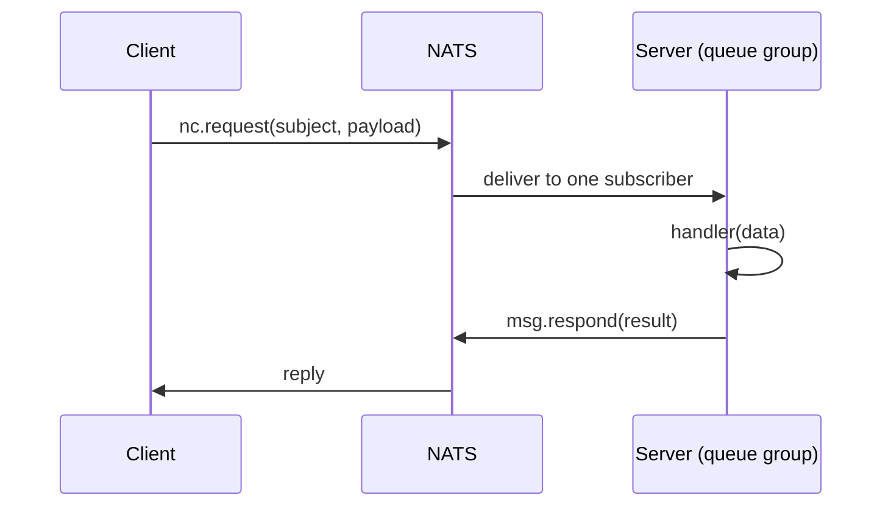
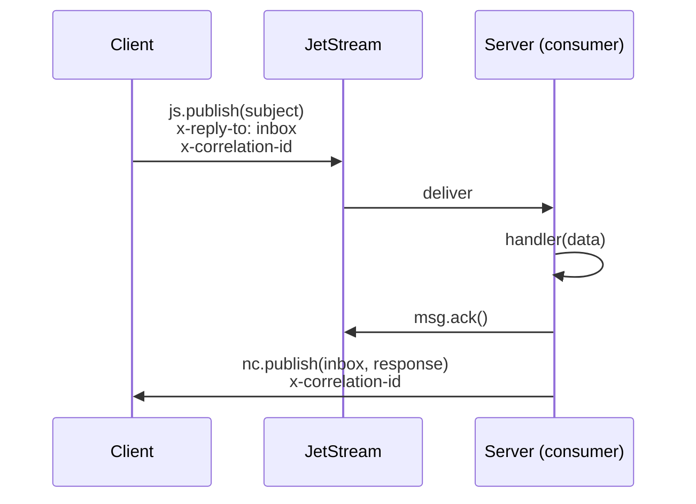

# RPC (Request/Reply)

Your API gateway needs to fetch an order from the orders microservice. The client sends a command, the handler processes it, and the response travels back — all within a timeout window. This is the **RPC (Remote Procedure Call)** pattern, and `nestjs-jetstream` supports two modes for it: **Core** and **JetStream**.

## Core Mode (Default)

Core mode uses NATS native request/reply — the fastest path with no persistence overhead. It is the default when you do not configure `rpc` or set `rpc.mode` to `'core'`.

### How it works

1. The client calls `nc.request(subject, payload, { timeout })` under the hood.
2. NATS routes the request to **one** subscriber via a **queue group** (automatic load balancing).
3. The handler processes the message and calls `msg.respond(result)` to send the reply.
4. The client receives the reply on a temporary inbox managed by NATS itself.



### Code example

**Sending an RPC command (client side):**

```typescript
import { Inject, Injectable } from '@nestjs/common';
import { firstValueFrom } from 'rxjs';
import { JetstreamClient, getClientToken } from '@horizon-republic/nestjs-jetstream';

@Injectable()
export class GatewayService {
  constructor(
    @Inject(getClientToken('orders'))
    private readonly ordersClient: JetstreamClient,
  ) {}

  async getOrder(id: string): Promise<Order> {
    return firstValueFrom(
      this.ordersClient.send<Order>('get.order', { id }),
    );
  }
}
```

**Handling the RPC command (server side):**

```typescript
import { Controller } from '@nestjs/common';
import { MessagePattern, Payload } from '@nestjs/microservices';

@Controller()
export class OrdersController {
  @MessagePattern('get.order')
  handleGetOrder(@Payload() data: { id: string }): Order {
    return this.ordersService.findById(data.id);
  }
}
```

:::tip
Handlers can return a plain value, a `Promise`, or an `Observable`. When returning an Observable, the transport takes the **first emitted value** as the response.
:::

### Error behavior

| Scenario | What happens |
|---|---|
| Handler throws `RpcException` | Error serialized via `getError()`, sent back with `x-error` header |
| Handler throws generic `Error` | `{ message }` extracted, sent back with `x-error` header |
| Handler throws plain object | Passed through as-is with `x-error` header |
| No handler registered | Error response returned immediately to caller |
| Decode failure | Error response returned to caller |
| Timeout exceeded | NATS returns a timeout error to the client |

## JetStream Mode

JetStream mode persists RPC commands in a stream before delivery. Responses still travel over Core NATS for low latency. Enable it by setting `rpc.mode` to `'jetstream'`.

```typescript
JetstreamModule.forRoot({
  name: 'orders',
  servers: ['nats://localhost:4222'],
  rpc: { mode: 'jetstream' },
});
```

### How it works

1. The client generates a **correlation ID** and registers a callback in its pending map.
2. The client publishes the command to JetStream via `js.publish()`, embedding the correlation ID and its **inbox subject** in headers (`x-correlation-id`, `x-reply-to`).
3. The RPC consumer delivers the message to the handler.
4. The handler executes within the timeout window. On success, the server calls `msg.ack()` and then publishes the response to the client's inbox via Core NATS `nc.publish()`.
5. The client's inbox subscription matches the correlation ID and resolves the pending callback.



### Code example

The application code is **identical** to Core mode — the transport handles the plumbing:

```typescript
// Same client code — mode is configured at module level, not per call
const order = await firstValueFrom(
  this.ordersClient.send<Order>('get.order', { id }),
);
```

### Error behavior

| Scenario | What happens |
|---|---|
| Handler throws `RpcException` | Error published to inbox with `x-error` header, message `term()`'d (no redelivery) |
| Handler throws generic `Error` | `{ message }` published to inbox, message `term()`'d |
| Handler throws plain object | Passed through to inbox, message `term()`'d |
| No handler registered | Message `term()`'d immediately, client times out |
| Missing headers (`x-reply-to` / `x-correlation-id`) | Message `term()`'d, client times out |
| Decode failure | Message `term()`'d, client times out |
| Handler timeout exceeded | Message `term()`'d, no response published |
| Response publish failure | Message still `ack()`'d (handler succeeded), client times out |

:::info Why `term()` instead of `nak()`?
RPC commands are **never** redelivered via `nak()`. Retrying a command could cause duplicate side effects (double charges, duplicate records). If the handler fails, the message is terminated and the error is returned to the caller, who can decide whether to retry.
:::

## Comparison: Core vs JetStream

| Aspect | Core Mode | JetStream Mode |
|---|---|---|
| **Latency** | Lowest (direct request/reply) | Slightly higher (stream persistence + inbox routing) |
| **Persistence** | None — fire and forget | Commands persisted in stream before delivery |
| **If server is offline** | Client gets timeout error immediately | Message queued in stream, delivered when server starts |
| **Retry on failure** | No built-in retry | No retry (`max_deliver: 1`), error returned to caller |
| **Default timeout** | 30 seconds | 3 minutes |
| **Load balancing** | NATS queue group | JetStream consumer (one delivery) |
| **Use case** | Low-latency queries, real-time lookups | Commands that must not be lost (payments, state changes) |

:::tip Choosing a mode
**Start with Core mode** (the default) for most use cases. Switch to JetStream mode when you need the guarantee that commands survive a brief server restart without the client seeing an error.
:::

## Error Handling

### Error serialization rules

The transport serializes errors differently based on their type:

```typescript
// 1. RpcException — full payload preserved
throw new RpcException({ code: 'NOT_FOUND', message: 'Order not found' });
// Client receives: { code: 'NOT_FOUND', message: 'Order not found' }

// 2. Generic Error — only message extracted
throw new Error('Something went wrong');
// Client receives: { message: 'Something went wrong' }

// 3. Plain object — passed through as-is
throw { code: 'VALIDATION_ERROR', fields: ['email'] };
// Client receives: { code: 'VALIDATION_ERROR', fields: ['email'] }
```

:::warning
Always prefer `RpcException` over generic `Error`. The `RpcException.getError()` method preserves your full error payload (status codes, validation details, etc.). A generic `Error` only passes the `message` string.
:::

### Custom exception filters

NestJS exception filters work with the JetStream transport. When a filter catches an error and returns an Observable (e.g., via `throwError()`), the transport unwraps it correctly:

```typescript
import { Catch, RpcExceptionFilter } from '@nestjs/common';
import { RpcException } from '@nestjs/microservices';
import { Observable, throwError } from 'rxjs';

@Catch(RpcException)
export class CustomRpcFilter implements RpcExceptionFilter<RpcException> {
  catch(exception: RpcException): Observable<never> {
    return throwError(() => exception);
  }
}
```

## Timeout Semantics

A single `timeout` value in `RpcConfig` controls **both sides** of the RPC call:

- **Client side** — how long the client waits for a response before rejecting with `"RPC timeout"`.
- **Server side (JetStream mode only)** — how long the handler has to complete before the message is `term()`'d.

| Mode | Default timeout | Config path |
|---|---|---|
| Core | 30,000 ms (30 s) | `rpc.timeout` |
| JetStream | 180,000 ms (3 min) | `rpc.timeout` |

```typescript
JetstreamModule.forRoot({
  name: 'orders',
  servers: ['nats://localhost:4222'],
  rpc: {
    mode: 'jetstream',
    timeout: 60_000, // 60 seconds for both client wait and handler limit
  },
});
```

### Per-request timeout override

You can override the global timeout for a single RPC call using `JetstreamRecordBuilder`:

```typescript
import { JetstreamRecordBuilder } from '@horizon-republic/nestjs-jetstream';

const record = new JetstreamRecordBuilder({ id: orderId })
  .setTimeout(5_000) // 5 second timeout for this call only
  .build();

const order = await firstValueFrom(
  this.ordersClient.send<Order>('get.order', record),
);
```

:::info
The per-request timeout overrides the client-side wait time. In JetStream mode, the server-side handler timeout is still governed by the global `rpc.timeout` configuration.
:::

See [Module Configuration](/docs/getting-started/module-configuration) for all `RpcConfig` options.

## Edge Cases

### Server not running

| Mode | Behavior |
|---|---|
| **Core** | Client receives a timeout error — no subscriber exists to handle the request. |
| **JetStream** | The command is persisted in the stream. When the server comes online, the consumer delivers it. If the client's timeout expires before the response arrives, the client gets a timeout error but the handler may still execute later. |

:::danger Stale responses in JetStream mode
If the client times out but the server processes the message later, the response is published to an inbox that no one is listening on. The response is silently discarded. Design handlers to be idempotent if this scenario is possible.
:::

### Observable returns

When a handler returns an `Observable`, the transport subscribes and takes the **first emitted value** as the RPC response. Subsequent emissions are ignored, and the subscription is cleaned up immediately.

```typescript
@MessagePattern('stream.first')
handleStream(): Observable<string> {
  return of('first', 'second', 'third');
  // Only 'first' is returned to the caller
}
```

### Double-settlement protection (JetStream mode)

The JetStream RPC router uses a `settled` flag to prevent race conditions between the handler completing and the timeout firing. Once the message is settled (ack'd, term'd, or timed out), any subsequent settlement attempt is a no-op. This means:

- If the handler completes just as the timeout fires, only one path executes.
- No duplicate responses are published to the client's inbox.

### Connection lost

When the NATS connection drops, **all pending JetStream-mode RPC callbacks** are immediately rejected with a `"Connection lost"` error. The client:

1. Rejects every pending callback in the `pendingMessages` map.
2. Clears all associated timeouts.
3. Tears down the inbox subscription.
4. Recreates the inbox on the next `connect()` call.

This fail-fast behavior prevents the client from hanging indefinitely when the network is down.

:::info Core mode disconnect
In Core mode, NATS handles disconnect behavior natively. Pending `nc.request()` calls are rejected by the NATS client library when the connection is lost.
:::

## See also

- [Record Builder](/docs/guides/record-builder) — custom headers, message IDs, per-request timeouts
- [Module Configuration](/docs/getting-started/module-configuration) — RPC mode selection and timeout config
- [Performance Tuning](/docs/guides/performance) — concurrency and ack extension for JetStream RPC
- [Troubleshooting](/docs/guides/troubleshooting#rpc-issues) — diagnosing timeout and routing errors
